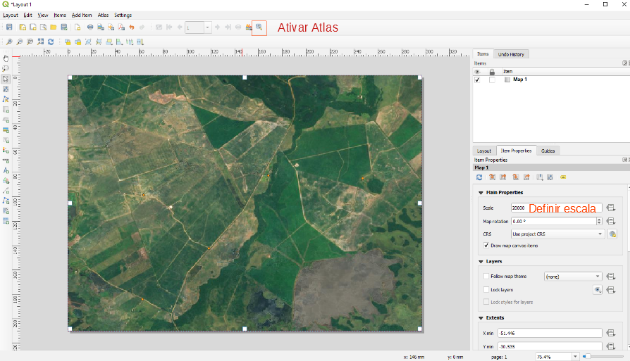
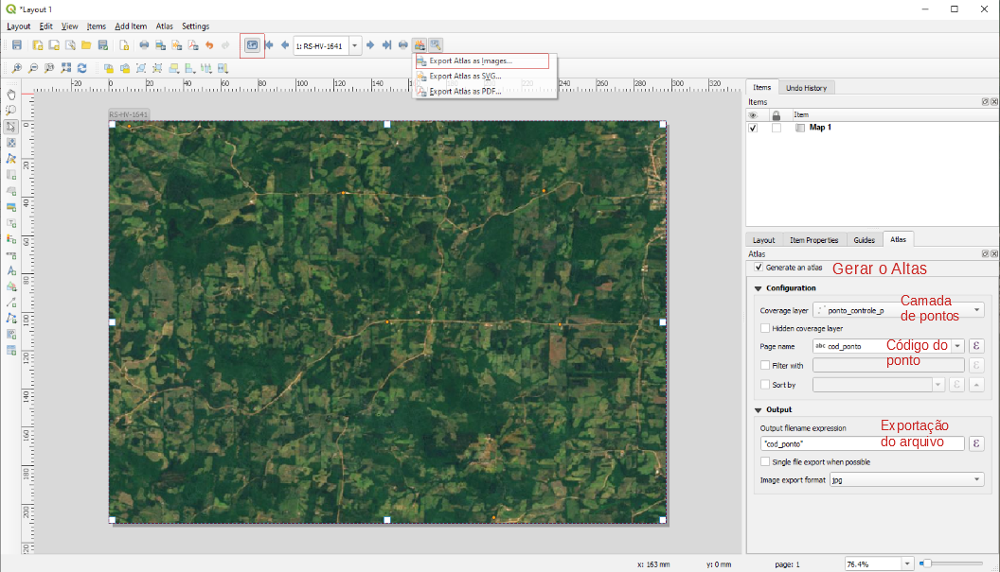
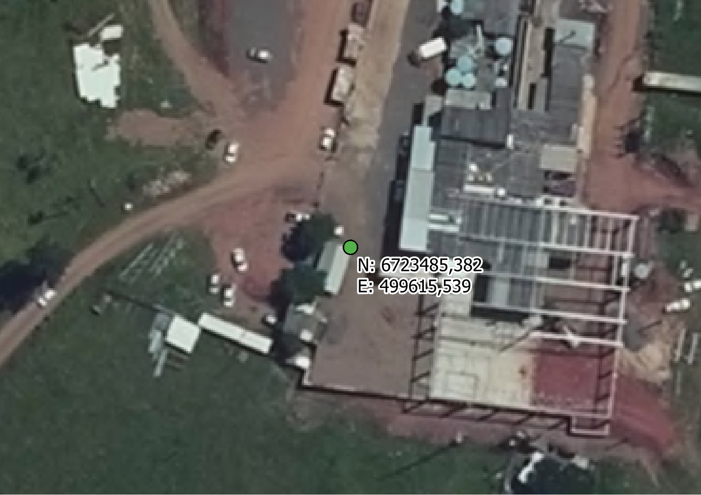
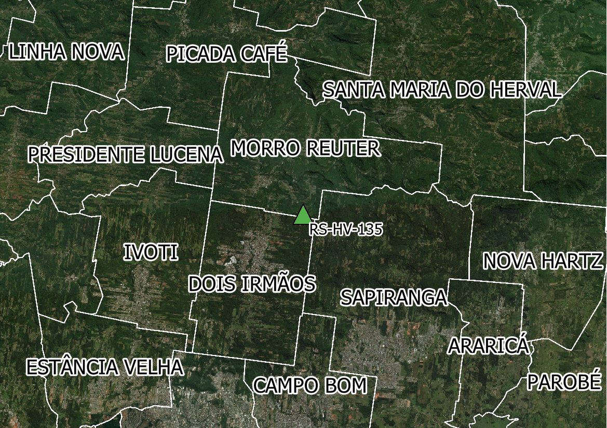
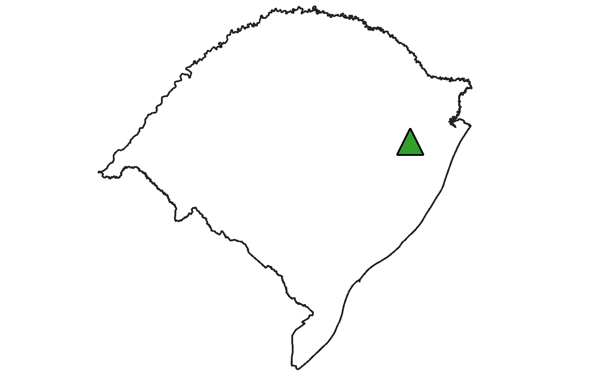

# Conjunto de rotinas complementares ao Plugin de Pontos de Controle
Conjunto de ferramentas que automatizam o processamento e controle de qualidade da medição de pontos de controle.
Essas ferramentas complementam as rotinas disponíveis em https://github.com/1cgeo/ferramentas_pto_controle, que devem ser utilizadas em conjunto!
Lembrar de utilizar o comando dentro da pasta da ferramenta (utilizar o comando cd)
Rotinas disponíveis neste repositório:
* 5- Gerar PPP
* 7- Atualizar banco com dados do PPP
* 9- Gerar Monografia

## Instalação
Certifique-se de ter instalado no seu computador as últimas versões do [NodeJS](https://nodejs.org/en/download/) e do [Python 3.X](https://www.python.org/downloads/)
São utilizadas as dependências [PyPDF2](https://github.com/mstamy2/PyPDF2), [TestCafé](https://github.com/DevExpress/testcafe) e [Secretary](https://github.com/christopher-ramirez/secretary)
Para instalar as dependências necessárias utilize os seguintes comandos:
```
npm install -g testcafe@0.17.2
pip install -r requirements.txt
```

### 5- Gerar PPP
Esta rotina acessa o portal do IBGE e realiza o download do processamento realizado pela plataforma de PPP do IBGE.
Após verificar quais PPPs já foram baixados, a ferramenta abre uma janela (ou múltiplas, a ser definido pleo argumento -c, que por padrão é 1) que realiza o download do PPP da página do IBGE.
O navegador utilizado deve estar configurado para realizar os downloads de forma automática.
Os parâmetros necessários para essa rotina são:
* Navegador a ser utilizado (de preferência chrome ou firefox)
* Pasta com a estrutura de pontos de controle
* Pasta que possui os PPPs já baixados (para evitar duplicatas)
* Email
```
testcafe -c 1 chrome ppp.js D:\2018-04-06 D:\downloads\ppp_existentes test@email.com.br
```
Caso necessário o uso de proxy, inserir o parâmetro --proxy como o exemplo a seguir:
```
testcafe -c 1 chrome ppp.js D:\2018-04-06 D:\downloads\ppp_existentes test@email.com.br --proxy username:password@proxy.mycorp.com:port
```

### 7- Atualizar banco com dados do PPP
Esta rotina atualiza o banco de dados com os dados do PPP.
Os parâmetros necessários para essa rotina são:
* Parâmetros de conexão do banco:
    * Host
    * Porta
    * Nome do Banco
    * Usuário
    * Senha
* Pasta com a estrutura de pontos de controle
Caso o arquivo lido seja um arquivo pdf, utilize:
```
python refreshFromPPP_pdf.py D:\2018-04-06 localhost 5432 banco_pt_controle usuario senha
```
Caso o arquivo lido seja um arquivo txt, utilize:
```
python refreshFromPPP_txt.py D:\2018-04-06 localhost 5432 banco_pt_controle usuario senha
```

### 9- Gerar Monografia
Esta rotina gera monografias baseadas no [Modelo](modelo.odt) em formato ODT.
Para utilizar esta rotina é necessário que o LibreOffice esteja instalado no computador.
Os parâmetros necessários para essa rotina são:
* Pasta com a estrutura de pontos de controle OU Pasta com várias estruturas de pontos de controle
* Parâmetros de conexão do banco:
    * Host
    * Porta
    * Nome do Banco
    * Usuário
    * Senha

**Importante**: A rotina espera que as imagens aéreas, as imagens do ponto e a assinatura estejam no formato horizontal(paisagem), e que a imagem do croqui e o brasão do CGEO estejam no formato vertical(retrato). Para as fotos do ponto (4 imagens da vista local do ponto), um pré-processamento dessas imagens adiciona uma borda branca caso a imagem esteja no formato vertical. Outras imagens não possuem pré-processamento, e serão deformadas se não estiverem na orientação correta.

**Antes de executar esta rotina, verificar parâmetros adicionais no arquivo [settings.json](generateMono/settings.json).**
No arquivo [settings.json](generateMono/settings.json) serão definidos:
* signature: Caminho da imagem jpeg da assinatura do responsável técnico dos pontos de controle
* pathImageCGEO: Caminho da imagem do brasão do CGEO
* pathLibreOffice: Caminho do arquivo soffice.exe no Windows (Localizado na pasta de instalação do LibreOffice) ou libreoffice no Linux (geralmente em /usr/bin/libreoffice)

```
python generateMonograpy.py D:\2018-04-06 localhost 5432 banco_pt_controle usuario senha
```

#### Como gerar as vistas aéreas em lote
1- Definir estilos e imagens

2- Gerar o compositor, definir a escala (na aba layout) e habilitar o atlas

3- Configurar o atlas como mostra a imagem abaixo. Não esquecer de habilitar a opção 'Controlado pelo Atlas' na aba Propriedades do item

4- Exportar as imagens na opção 'Exportar Atlas como imagem'. As imagens geradas deverão estar no formato .jpg!
Exemplos de vistas aéreas:

|Imagem|Exemplo|
|-----|-----|
|photoCGEO|<p align="center"></p>|
|photoAerView||
|photoView1||
|photoView2||
