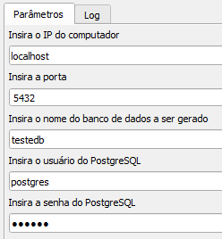

Criar um banco de dados para armazenamento e atualização dos Pontos de Controle.

# Requisitos Mínimos

O usuário precisa ter, previamente instalado, um gerenciador de banco de dados com extensão de gerenciamento espacial [(Postgresql + PostGIS)](https://postgis.net/windows_downloads/).

## Preenchimento dos Dados
* IP da máquina: localhost (para trabalho local) ou IP da máquina onde o banco será/está armazenado;
* Porta: geralmente 5432 (local e em rede);
* Nome do banco a ser gerado;
* Usuário do PostgreSQL;
* Senha do PostgreSQL; e
* Clique em Executar, a mensagem recebida deverá conter 'Processamento Concluído'.

| |
|:--:|
| *Criação do Banco de Dados* |

## Verificação do Banco
Caso existam dúvidas sobre a criação do banco, basta percorrer os servidores do pgAdmin e verificar se o banco foi criado ou não. 

| |
|:--:|
| *Banco de Dados no pgAdmin* |

Caso já exista um banco de dados com o mesmo nome, a ferramenta não irá sobrescrevê-lo.
