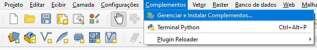
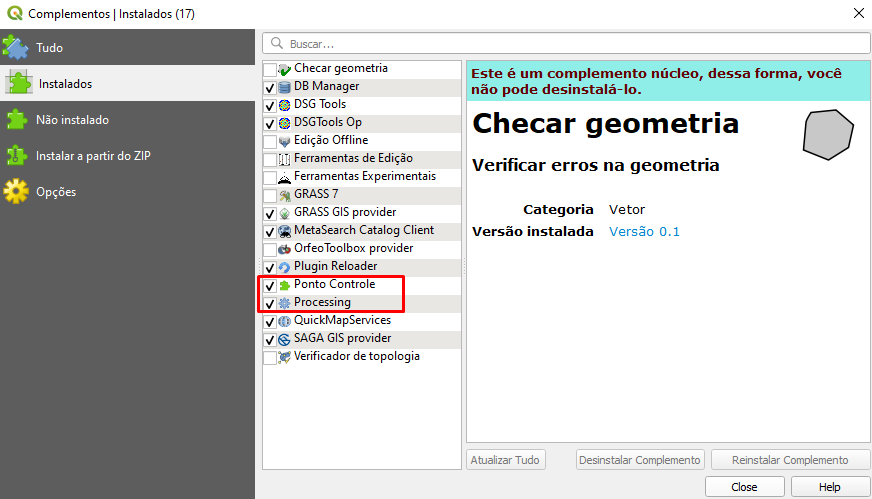
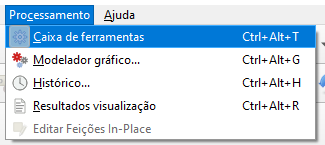

Download das ferramentas necessárias para Ponto de Controle.

# Requisitos Mínimos

* Realize o download, através desse [repositório](https://github.com/dsgoficial/pto_controle.git) ou baixe o formato .zip e descompacte-o na pasta.
* Link para download do [node.js](https://nodejs.org/en/)
* Link para download do [python](https://www.python.org/downloads/)
    * São utilizadas bibliotecas dependentes, disponíveis no arquivo *requirements.txt*

## No QGIS
Prossiga para **Configurações > Perfis de Usuário > Abrir Pasta de Perfil Ativo**
* Dentro dessa pasta, entre na pasta **python > plugins**;
* Nessa pasta, copie a pasta **ferramentas_pto_controle** que foi baixada durante a etapa de Instalação; e
* Reinicie o QGIS para aplicação das mudanças.

No QGIS, prossiga até a aba **Complementos > Gerenciar e Instalar Complementos > Instalados**
* Ative o Processing e o Ponto de Controle
* Isso habilita a aba Processamento e Ferramentas para Pontos de Controle na Caixa de Ferramentas de Processamento do QGIS (Ctrl + Alt + T), conforme imagens abaixo:

| |
|:--:|
| *Gerenciar e Instalar Complementos* |

| |
|:--:|
| *Complementos Instalados* |

| |
|:--:|
| *Aba de Processamento - Caixa de Ferramentas* |

| |
|:--:|
| *Ferramentas para Ponto de Controle* |

## Na máquina

Escolha uma pasta raiz e copie a pasta **rotinas_complementares_pto_controle**.
* Siga as instruções dos passos seguintes, quando necessário for, utilize os arquivos dessa pasta para realizar o processamento.